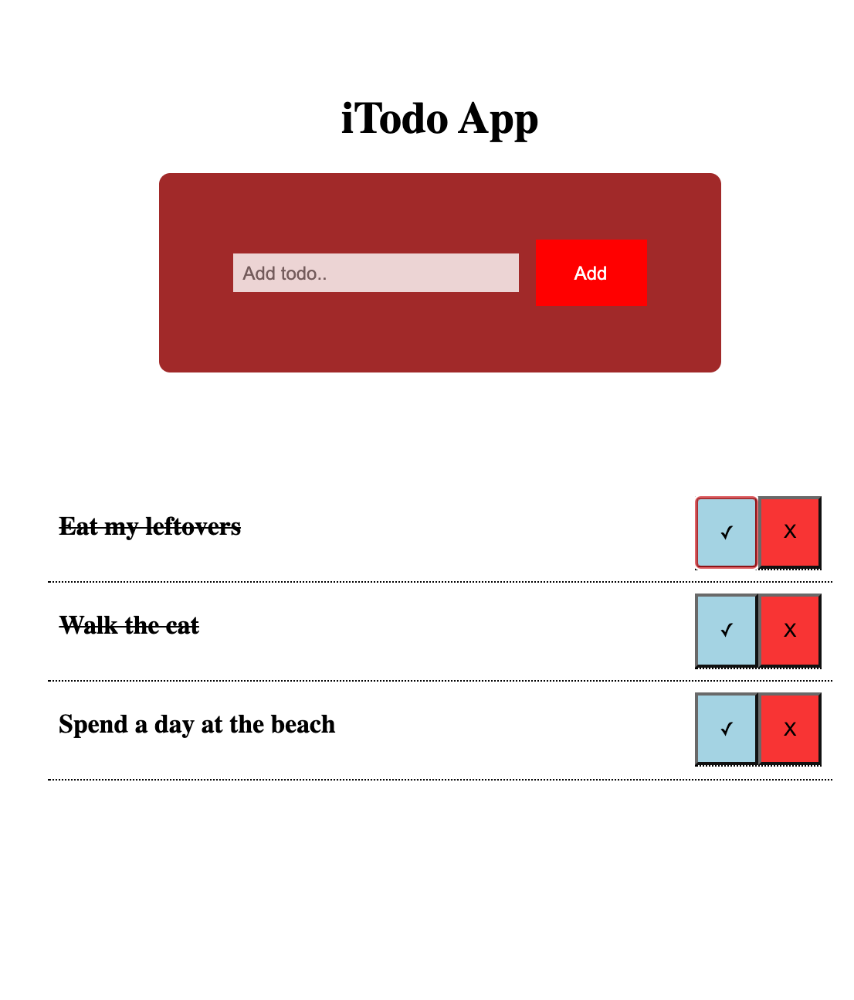

# Vanilla JS Todo-App

A Todo-App built is Javascript, Css, and Html.

Link = {Live}

<h3>Summary</h3>
  
I created this App because it's a classic App to create. I learned and solified my knowledge in classes and how to create things with the constructor. This App has the ability to create a new todo item, delete an existing todo item, and put a line through a todo item.

<h3>Author</h3>

Roger Alexander - Full Stack Developer
